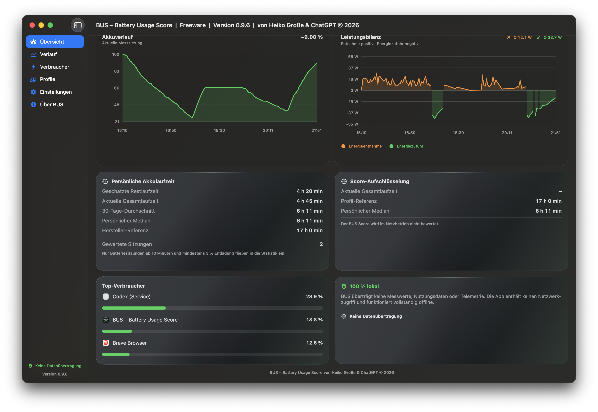
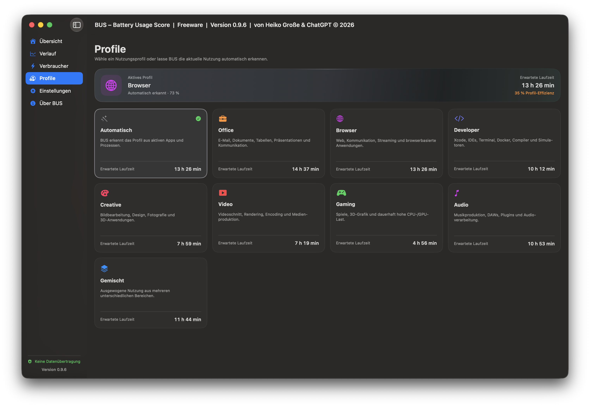
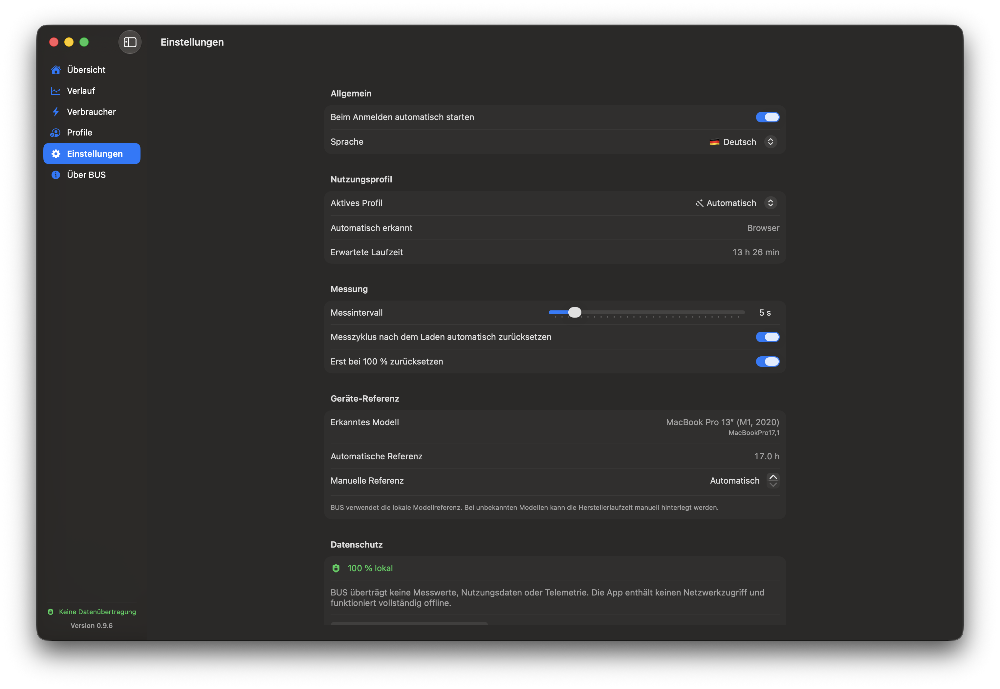
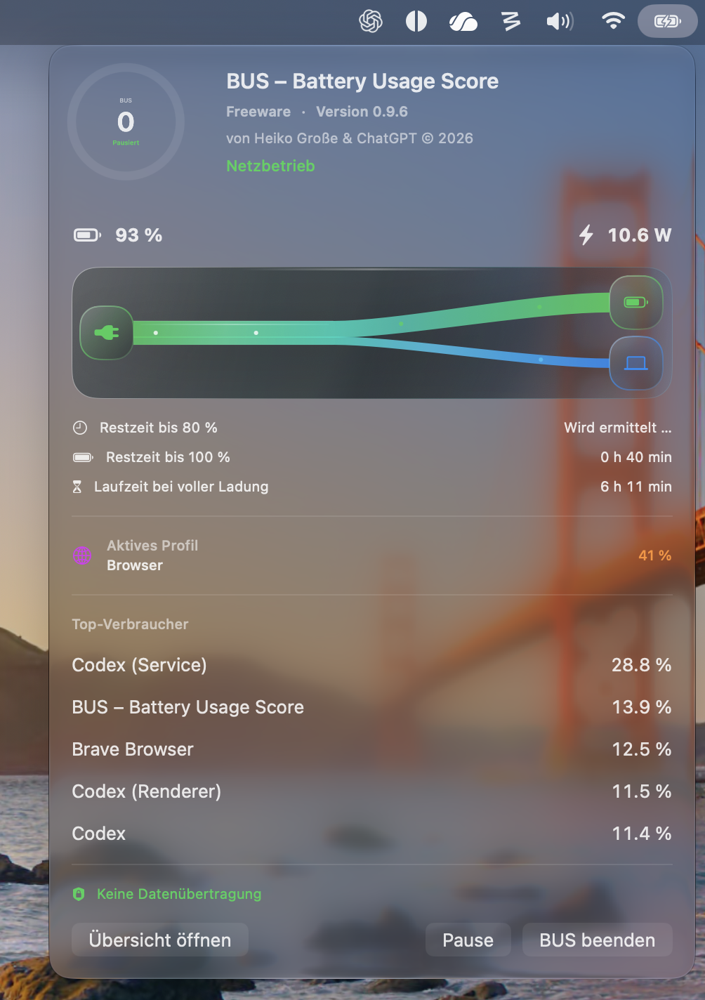
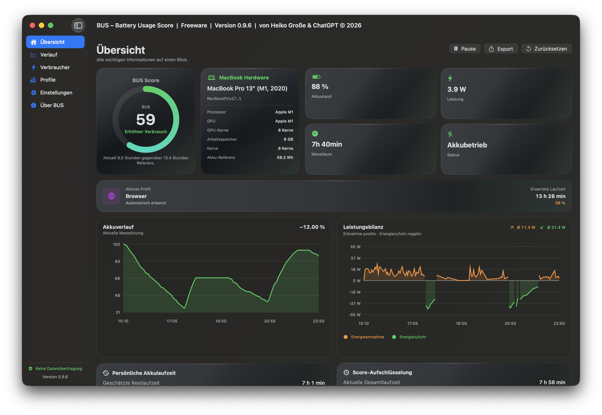

# BUS – Battery Usage Score

Eine native macOS-Menüleisten-App zur lokalen Analyse des geschätzten Batterieverbrauchs pro App.

**BUS – Battery Usage Score von Heiko Große & ChatGPT © 2026**

## App-Vorschau

Die aktuelle Version als native macOS-App:

<table>
  <tr>
    <td><strong>Übersicht</strong><br></td>
    <td><strong>Laden</strong><br></td>
    <td><strong>Profile</strong><br></td>
  </tr>
  <tr>
    <td><strong>Einstellungen</strong><br></td>
    <td><strong>Menüleisten-Popover</strong><br></td>
    <td><strong>Hardware-Karte</strong><br></td>
  </tr>
</table>

## Funktionen

- professionelles Dashboard mit BUS Score
- grafischer Akku- und Leistungsverlauf
- geschätzter Verbrauch pro App
- Menüleistenanzeige
- Autostart beim Anmelden
- automatischer Reset nach dem Trennen vom Ladegerät
- Deutsch, Englisch, Französisch, Spanisch, Italienisch, Niederländisch, Japanisch und vereinfachtes Chinesisch
- Sprachauswahl beim ersten Start und später in den Einstellungen
- CSV-Export
- vollständig lokale Speicherung

## Datenschutz

BUS enthält absichtlich keinen Netzwerkcode. Das Buildskript führt vor jedem Build `privacy-audit.sh` aus und bricht ab, falls bekannte Netzwerk-APIs im Quellcode auftauchen.

Die App verwendet keine:
- Telemetrie
- Analyse-Dienste
- Cloud-Synchronisation
- Update-Abfragen
- externen Server

## Build und Installation

```bash
bash "/Pfad/zu/BUS-v0.1-SwiftPackage/kompilieren-und-installieren.sh"
```

Erfordert Apple Command Line Tools und macOS 13 oder neuer. Getestete Zielumgebung: macOS 27 / Swift 6.4.

## Veröffentlichbare DMG erzeugen

Das Release-Skript baut App und Hardware Helper, erstellt ein macOS-
Installationspaket und verpackt es zusammen mit einer Kurzanleitung als DMG:

```bash
bash release-dmg.sh
```

Das Ergebnis liegt als `dist/BUS-<Version>.dmg` samt SHA-256-Prüfsumme vor.
Ohne Zertifikate wird ein lokal testbarer, ad-hoc-signierter Build erzeugt.
Für eine öffentliche Veröffentlichung werden eine Developer-ID-Anwendungs- und
Installer-Identität sowie ein gespeichertes Notarisierungsprofil angegeben:

```bash
APP_SIGN_IDENTITY="Developer ID Application: …" \
INSTALLER_SIGN_IDENTITY="Developer ID Installer: …" \
NOTARY_PROFILE="BUS-notary" \
bash release-dmg.sh
```

## Hinweis zur Genauigkeit

macOS stellt keine offizielle Akkuabrechnung pro App bereit. BUS verteilt die gemessene Entladung anhand von CPU-Zeit, Datenträger-I/O und Wakeups. Die Werte sind daher technische Schätzungen.


## Korrektur in 0.1.1

Die reinen Command Line Tools von macOS 27 konnten das neue
`SwiftUIMacros.StateMacro` nicht laden. Die beiden lokalen UI-Zustände wurden
deshalb von `@State` auf klassische `ObservableObject`-/`@StateObject`-Modelle
umgestellt.

Zusätzlich gibt das Buildskript bei einem Abbruch jetzt den tatsächlichen
Fehlercode aus.


## Neu in 0.1.2 – Prozesse nach App gruppiert

BUS ordnet Prozesse anhand des äußeren macOS-App-Bundles ihrer Anwendung zu.

- Haupt-, Renderer-, GPU-, Netzwerk- und Hilfsprozesse werden zusammengefasst.
- Die App-Zeile zeigt die Gesamtsumme.
- Ein Klick klappt die einzelnen Prozesse auf oder zu.
- Prozessdetails zeigen Name, PID, Bundle-ID, Akkuanteil, CPU, I/O und Wakeups.
- Der CSV-Export enthält App- und Prozesszeilen.
- Ältere Sitzungen bleiben lesbar.


## Korrekturen in 0.1.3 – konsequent für macOS 27

BUS wird jetzt ausschließlich für macOS 27 oder neuer gebaut:

- Swift-Package-Plattform: macOS 27.0
- Deployment Target: macOS 27.0
- LSMinimumSystemVersion: 27.0
- Buildabbruch, wenn macOS oder SDK älter als 27 ist
- `ContentUnavailableView` darf dadurch direkt verwendet werden
- Typkonflikt bei `foregroundStyle` wurde durch explizite `Color`-Werte behoben
- FinderInfo, Resource Forks und Quarantäne werden vor der Signaturprüfung entfernt

Die Meldungen zu fehlenden Suchpfaden innerhalb der reinen Command Line Tools
können weiterhin als Linker-Warnungen erscheinen. Sie sind nicht fatal, solange
der Build anschließend fortgesetzt wird.


## Neu in 0.1.4

- Vollständig neu gestaltete Verbraucheransicht.
- Gruppierung nach App oder Einzelprozess.
- App-Icons, Verbrauchsbalken, Summenzeile und Filter.
- Safari/WebKit-, Brave-, Chrome-, Edge-, Opera-, ChatGPT- und BUS-Hilfsprozesse
  werden der richtigen Haupt-App zugeordnet.
- Bestehende Messdaten werden beim Start automatisch neu gruppiert.
- Historische Einzelzeilen aus älteren Versionen erscheinen als ausklappbare
  Prozessdetails innerhalb der Haupt-App.
- Compilerkompatibel mit macOS 27 und Swift 6.4 Command Line Tools.


## Korrektur in 0.1.5

Der Prozessmodus verwendete bisher ein Swift-Tupel als Element von `ForEach`.
Tupel können `Identifiable` nicht implementieren. Die Zeilen werden jetzt durch
den konkreten Typ `FlattenedProcessRow` mit stabiler kombinierter ID aus App-
und Prozess-ID dargestellt.


## Neu in 0.1.6

- Responsive Übersicht für unterschiedlich große Fenster.
- Statuskarten wechseln automatisch zwischen ein- und zweispaltiger Darstellung.
- Akkuverlauf, Top-Verbraucher und Datenschutzkarte ordnen sich abhängig von
  der verfügbaren Fensterbreite neu an.
- Kleinere Mindestfenstergröße ohne abgeschnittene Inhalte.
- Titelleiste enthält:
  `BUS – Battery Usage Score | Freeware | Version x.x.x | von Heiko Große & ChatGPT © 2026`
- Versionsnummer wird innerhalb der App direkt aus der `Info.plist` gelesen.
- Das Buildskript liest Version und Buildnummer ebenfalls automatisch aus der
  `Info.plist`. Dadurch gibt es keine voneinander abweichenden Versionsangaben.
- Versionsanzeige in Seitenleiste, Menüleistenfenster und Info-Bereich ist
  ebenfalls dynamisch.


## Korrekturen in 0.1.7

- Ungültiges `HStack(alignment: .stretch)` durch ein gültiges
  `HStack(alignment: .top)` ersetzt.
- Neue Datei `swiftui-preflight.sh`.
- Die Vorabprüfung läuft automatisch vor jedem Build.
- Geprüft werden unter anderem:
  - ungültige `.stretch`-Stack-Ausrichtungen,
  - problematische `@State`-Deklarationen bei reinen Command Line Tools,
  - macOS-Deployment-Target,
  - Mindestversion in der Info.plist,
  - grob unausgeglichene Swift-Klammerstrukturen.
- Version auf 0.1.7, Build 8 erhöht.


## Neu in 0.1.8

- Diagramme besitzen feste Höhen und bleiben vollständig innerhalb ihrer Karten.
- Karten clippen ihren Inhalt an der abgerundeten Kartenform.
- Akku- und Leistungsverlauf stehen bei breiten Fenstern nebeneinander und
  werden bei kleineren Fenstern automatisch untereinander angeordnet.
- Übersicht deutlich kompakter mit kleinerem Score-Bereich und weniger Leerraum.
- Statuskarten verwenden je nach Fensterbreite ein, zwei oder vier Spalten.
- Verlaufsansicht enthält zwei eigenständige Diagrammkarten.
- Verbraucheransicht zeigt Gesamtsumme und Hinweis direkt nach der Liste.
- Standardfenstergröße: 1280 × 820.
- Version 0.1.8, Build 9.


## Neu in 0.2.0 – Modellscore und lokale Laufzeitstatistik

- Automatische Erkennung zusammenhängender Batteriesitzungen.
- Eine Sitzung beginnt beim Trennen und endet beim Anschließen des Netzteils.
- Nur Sitzungen ab 10 Minuten und mindestens 3 % Entladung werden gewertet.
- Lokale Speicherung in `runtime-sessions.json`.
- Aktuelle Hochrechnung der Gesamtlaufzeit und Restlaufzeit.
- Persönlicher Durchschnitt, 30-Tage-Durchschnitt und Median.
- Lokale Geräteerkennung über `hw.model`.
- Integrierte Referenzprofile für verbreitete Apple-Silicon-MacBooks.
- Manuelle Herstellerreferenz für noch unbekannte Modelle.
- Neuer BUS Score:
  - zunächst Vergleich mit der Modellreferenz,
  - ab 5 Sitzungen 40 % persönliche Referenz,
  - ab 20 Sitzungen 60 % persönliche Referenz.
- Ausklappbare, nachvollziehbare Score-Bestandteile.
- Score pausiert im Netzbetrieb und wird erst nach drei Minuten Akkubetrieb berechnet.
- Laufzeitstatistik und Batteriesitzungen im Verlauf.
- CSV-Export enthält zusätzlich lokale Batteriesitzungen.
- Keine Netzwerkkommunikation; sämtliche Daten bleiben lokal.


## Korrekturen und Änderungen in 0.3.0

- Alle acht Syntaxfehler in `Localization.swift` behoben.
- Ursache war jeweils ein fehlendes Komma zwischen `scoreExplanation` und
  `scoreDetails`.
- Menüleistenfenster auf 460 Punkte verbreitert.
- Freeware-Hinweis und Versionsnummer werden in einer eigenen Zeile angezeigt.
- Creator-Hinweis wird separat dargestellt und kann vollständig umbrechen.
- App-Name, Version und Buildnummer stammen weiterhin zentral aus der
  `Info.plist`.
- Die Build-Vorabprüfung führt nun einen echten Swift-Parserlauf über alle
  Swift-Dateien aus.
- Lokalisierungsprüfung erkennt fehlende Trennzeichen vor dem eigentlichen
  Release-Build.
- Version 0.3.0, Build 11.


## Compilerkorrektur in 0.3.1

`ActiveRuntimeSession` war unnötig als `Hashable` deklariert. Der enthaltene
Typ `BatterySnapshot` war jedoch nicht `Hashable`, wodurch Swift die
automatische Konformität nicht erzeugen konnte.

Da `ActiveRuntimeSession` weder als Dictionary-Schlüssel noch in einem Set
verwendet wird, wurde die unnötige `Hashable`-Konformität entfernt.

- Version 0.3.1
- Build 12
- Persistenz über `Codable` bleibt vollständig erhalten.


## Neu in 0.3.2

- Absturz beim Wechsel einer Sprache beziehungsweise Auswahl behoben:
  `@Published language` löst keine zweite manuelle `objectWillChange`-
  Benachrichtigung mehr aus.
- Auswahlfelder verwenden abgesicherte Bindings.
- Verbraucher können durch Klick auf jede Tabellenüberschrift sortiert werden.
- Erneuter Klick kehrt die Sortierrichtung um.
- Sortierspalte und Sortierrichtung werden lokal gespeichert.
- Suche nach App-, Prozess- und Bundle-Namen mit ⌘F.
- Gruppierungsmodus und Filter werden lokal gespeichert.
- Prozesse innerhalb einer aufgeklappten App folgen derselben Sortierung.
- BUS ist wieder eine reguläre Dock-App.
- Rechtsklick auf das Dock-Symbol bietet:
  Übersicht, Verlauf, Verbraucher, Pause/Fortsetzen, Export und Beenden.
- Dock-Menüpunkte bringen ein minimiertes oder verdecktes Hauptfenster nach vorn.
- Version 0.3.2, Build 13.


## Neu in 0.3.3 – Animierter Ladefluss

- Eigene Ladeansicht bei angeschlossenem Netzteil.
- Modern animierter Energiefluss:
  - Netzteil → Akku
  - Netzteil → System
- Partikelgeschwindigkeit und Anzahl reagieren auf die gemessene Leistung.
- Bei aktivierter Bedienungshilfe „Bewegung reduzieren“ wird die Animation
  automatisch pausiert.
- Anzeige von:
  - Netzteil-Leistung,
  - geschätztem Systemverbrauch,
  - Akku-Ladeleistung,
  - Ladegeschwindigkeit in Prozent pro Stunde,
  - Restzeit bis 80 %,
  - Restzeit bis 100 %,
  - geschätzter Laufzeit beim aktuellen Ladestand,
  - geschätzter Laufzeit bei voller Ladung.
- Ab 80 % berücksichtigt die Restzeitberechnung die reduzierte Ladeleistung.
- Netzteilwerte werden, soweit vom AppleSmartBattery-Treiber bereitgestellt,
  direkt lokal ausgelesen. Nicht verfügbare Werte werden klar als Schätzung
  gekennzeichnet.
- Version 0.3.3, Build 14.


## Compilerkorrektur in 0.3.4

- Nicht unterstützten View-Modifier `.symbols { ... }` entfernt.
- `GraphicsContext.resolveSymbol` entfernt.
- SF-Symbole werden direkt mit `GraphicsContext.resolve(Image(systemName:))` aufgelöst.
- Vorabprüfung blockiert die nicht unterstützten Canvas-Symbol-APIs künftig automatisch.
- Version 0.3.4, Build 15.


## Neu und korrigiert in 0.3.5

- Absturz beim Ändern der manuellen Geräte-/Laufzeitreferenz behoben.
- Ursache: `manufacturerRuntimeOverrideHours` schrieb im eigenen `didSet`
  erneut in dieselbe Property und erzeugte eine Endlosrekursion.
- Derselbe Fehler wurde vorsorglich auch bei `sampleInterval` beseitigt.
- Einstellungen schreiben nun ausschließlich über sichere Update-Methoden.
- Ladefluss vollständig neu gestaltet:
  - weiche Farbverläufe ohne harte Übergänge,
  - sanfter, leuchtender Verteilerpunkt,
  - mehrstufige Glow- und Highlight-Ebenen,
  - harmonische Kurven und kleinere Knoten.
- Leistungszweige werden proportional dargestellt:
  - Pfadbreite entspricht dem Verhältnis von Akku-Ladeleistung zu
    Systemverbrauch,
  - Partikelzahl und Geschwindigkeit folgen ebenfalls dem Verhältnis,
  - Mindestbreiten halten kleine Zweige sichtbar.
- Watt- und Prozentanteile werden direkt am großen Flussdiagramm angezeigt.
- Kompakter animierter Ladefluss zusätzlich im Menüleistenfenster.
- Version 0.3.5, Build 16.


## Neu in BUS 0.4.1

### Nutzungsprofile
- Automatisch, Office, Browser, Developer, Creative, Video, Gaming, Audio
  und Gemischt.
- Automatische lokale Erkennung anhand aktiver Apps und Prozesse.
- Profilabhängige Laufzeitreferenz für das erkannte Mac-Modell.
- Profil-Effizienz in Übersicht, Menüleistenfenster und Score-Berechnung.
- Eigene Profilbibliothek mit direkter Auswahl.
- Auswahl wird lokal gespeichert und kann jederzeit auf Automatisch gestellt
  werden.

### Exakt proportionaler Ladefluss
- Der ankommende Netzteilpfad entspricht 100 Prozent der Gesamtleistung.
- Die beiden Ausgangspfade teilen dessen Breite exakt im Leistungsverhältnis:
  27 W von 60 W werden als 45 Prozent dargestellt,
  33 W von 60 W als 55 Prozent.
- Die beiden Ausgangsbreiten ergeben zusammen exakt die Eingangsbreite.
- Der störende Mittelpunkt wurde vollständig entfernt.
- Auch die Partikelmenge folgt dem tatsächlichen Leistungsverhältnis.

### Leistungsbilanz
- Energieentnahme aus dem Akku erscheint oberhalb der Nulllinie in Orange.
- Energiezufuhr beim Laden erscheint unterhalb der Nulllinie in Grün.
- Getrennte Durchschnittswerte für Entnahme und Ladung.
- Historische Daten ohne Vorzeichen werden anhand des damaligen
  Netzanschlussstatus korrekt eingeordnet.

Version 0.4.0, Build 17.


## Korrekturen in BUS 0.4.1

### Realistischere Ladeleistung
- Die vom Treiber gemeldeten 60 W werden als maximale Netzteil-Nennleistung
  behandelt und nicht mehr als aktuell fließende Leistung.
- Die aktuelle Eingangsleistung wird geschätzt aus:
  - echter Akku-Ladeleistung (Batteriespannung × Batteriestrom),
  - geglättetem Systemverbrauch aus dem vorherigen Batteriebetrieb.
- Für den Systemverbrauch verwendet BUS bevorzugt den Median der letzten
  Entladungsmessungen vor Beginn des Ladens.
- In der Karte stehen nun aktuelle Eingangsleistung und Netzteil-Maximum
  getrennt voneinander.

### Flüssigere Ladeanimation
- Zeichenrate auf 20 Bilder/s im Hauptfenster und 15 Bilder/s im Menü reduziert.
- Asynchrones Canvas aktiviert.
- Teure Blur-Filter aus jedem Animationsbild entfernt.
- Partikelanzahl deutlich reduziert.
- Gleichmäßige lineare Bewegung ohne Beschleunigungsruckler.
- Änderungen der Leistung werden über 0,85 Sekunden weich interpoliert.
- Die Pfadbreiten bleiben exakt proportional.

### Leistungsbilanz
- Entnahme und Ladung sind technisch getrennte Chart-Serien.
- Energieentnahme wird ausschließlich orange dargestellt.
- Energiezufuhr wird ausschließlich grün dargestellt.
- Wechsel zwischen Laden und Entladen verbindet die beiden Reihen nicht mehr
  fälschlich miteinander.
- Ältere lokale Verlaufsdaten ohne Vorzeichen bleiben kompatibel.

Version 0.4.1, Build 18.


## Compilerkorrektur in BUS 0.7.0

- Die drei `@State`-Eigenschaften der Ladeanimation wurden vollständig
  entfernt.
- Ursache: Die macOS-27-Command-Line-Tools können im echten Release-Build das
  externe Makro `SwiftUIMacros.StateMacro` nicht laden.
- Der Animationszustand liegt nun in `ChargingFlowAnimationState`, einem
  klassischen `ObservableObject` mit `@Published`.
- `AnimatedChargingFlow` bindet den Zustand über das bereits im restlichen
  Projekt bewährte `@StateObject`.
- Direkte Schreibzugriffe auf eine unveränderliche SwiftUI-View entfallen.
- Die Vorabprüfung durchsucht künftig alle Swift-Dateien und stoppt bereits vor
  dem Build, sobald erneut ein echtes `@State` eingebaut wurde.
- Version 0.4.3, Build 20.


## BUS 0.5.0 – Read-only Hardware Helper

BUS enthält nun einen rein lesenden, lokalen Hardware Helper.

### Messstrategie

1. Akku-Leistung wird direkt über Batteriespannung × Batteriestrom ermittelt.
2. Der Helper prüft zusätzlich mehrere modellabhängige Apple-SMC-Sensoren auf
   aktuelle Eingangs- und Systemleistung.
3. Liefert das Mac-Modell einen plausiblen Eingangssensor, zeigt BUS den Wert
   als „Per Hardware-Sensor gemessen“ an.
4. Ist nur die Akku-Leistung messbar, leitet BUS den Eingang weiterhin lokal
   aus Akku-Leistung und dem persönlichen Systemverbrauch ab und kennzeichnet
   dies ausdrücklich.
5. Die Netzteil-Nennleistung bleibt separat und wird niemals als aktuelle
   Leistung behandelt.

Der Helper schreibt ausschließlich eine lokale JSON-Datei:

`/Library/Application Support/BUS/hardware.json`

Es bestehen keine Netzwerkverbindungen und der Helper kann den Ladevorgang
nicht steuern oder verändern.

### Exakte Flussproportionen

- Eingangsstrahl = 100 Prozent der aktuell verwendeten Eingangsleistung.
- Akku-Strahl = `Akku-Leistung / Gesamtleistung`.
- System-Strahl = `Systemleistung / Gesamtleistung`.
- Beide Ausgangsbreiten ergeben mathematisch exakt die Eingangsbreite.
- Es gibt keine künstlichen Mindestbreiten mehr.
- Auch die Partikelmenge wird ohne Mindestwert exakt proportional verteilt.

### Flüssige Animation

- 30 Bilder/s im Hauptfenster.
- 24 Bilder/s in der Menüansicht.
- Zeitbasierte exponentielle Glättung statt sprunghafter Messwertwechsel.
- Die Glättung ist unabhängig von schwankenden Bildraten.
- Keine Blur-Filter und keine teuren Layout-Neuberechnungen pro Bild.
- Kein `@State`; kompatibel mit macOS 27, Swift 6.4 und den Command Line Tools.

Version 0.5.0, Build 21.


## BUS 0.5.1 – Getrennter Ladefluss

- Der Akku- und Systemzweig beginnen nicht mehr auf derselben Mittellinie.
- Der grüne Zweig setzt an der oberen Hälfte des Eingangsstroms an.
- Der blaue Zweig setzt an der unteren Hälfte an.
- Eine feste Trennfuge verhindert jede optische Überlappung.
- Die Zweige werden als gefüllte, sanft breiter werdende Flächen gezeichnet.
- Beide Zweige besitzen stets exakt das Watt-Verhältnis der Messwerte.
- Die gemeinsame Expansion verändert nur die Optik, niemals das Verhältnis.
- Keine künstliche Mindestbreite.

### Einheitliche Animation

- Alle drei Wege verwenden dieselbe Geschwindigkeit in Pixeln pro Sekunde.
- Die Kurvenlänge wird numerisch berechnet.
- Die Partikelposition wird anhand der tatsächlich zurückgelegten Strecke
  bestimmt und nicht anhand eines einfachen Bezier-Parameters.
- Dadurch laufen Partikel auf kurzen, langen, geraden und gekrümmten Wegen
  sichtbar gleich schnell.
- Leistungsanteile beeinflussen nur Partikelanzahl und Strahlbreite.
- Einheitliche Bildrate von 30 Bildern/s in Hauptfenster und Menüansicht.

Version 0.5.1, Build 22.


## BUS 0.5.2 – Verteiler und stabile Animation

### Optischer Verteiler

- Der runde, weiße Mittelpunkt wurde vollständig entfernt.
- Der Eingangsstrahl endet nun mit einer geraden Kante.
- Zwischen Eingang und beiden Ausgangsstrahlen sitzt ein kurzer,
  abgerundeter Verteilerblock.
- Eine dunkle horizontale Trennfuge führt die obere und untere Hälfte sauber
  auseinander.
- Ein dezenter Mittelmarker ersetzt den vorherigen hellen Lichtpunkt.
- Auch bei 0 W Akku-Ladeleistung bleibt der Übergang zum Systemzweig sauber.

### Gleichmäßige Animation

- Akku- und Systemzweig besitzen eine stabile Partikelanzahl.
- Änderungen des Watt-Verhältnisses erzeugen keine neuen Partikelpositionen
  und keine sichtbaren Sprünge mehr.
- Der Leistungsanteil verändert nur Größe und Helligkeit der Partikel.
- Geschwindigkeit, Abstand und Phase bleiben konstant.
- Alle Wege verwenden weiterhin dieselbe Geschwindigkeit in Pixeln pro
  Sekunde.
- Keine weißen Partikel mehr am Übergang.

Version 0.5.2, Build 23.


## BUS 0.6.0 – Nahtloser Leistungsfluss und Liquid Glass

### Exakte Geometrie

- Der linke Leistungsstrom beginnt exakt an der rechten Außenkante des
  Netzteil-Symbols.
- Akku- und Systemstrom enden exakt an den linken Außenkanten ihrer Symbole.
- Beide Ausgangsflächen teilen an der Verzweigung gemeinsam exakt den
  vollständigen Querschnitt des Eingangsstroms.
- Es gibt keinen separaten Verteilerblock, keinen Spalt und keinen Überstand.
- Die obere und untere Außenkante gehen tangential und kontinuierlich in die
  beiden Zielströme über.
- Bei 0 Prozent eines Zweigs übernimmt der andere Zweig lückenlos den gesamten
  Eingangsquerschnitt.

### Liquid Glass

- Leistungsstrom, Symbole und Karten verwenden dieselbe Glas-Materialsprache.
- Ultra-thin Material, gerichtete Lichtkante, feine Reflexion und weiche
  Tiefenschatten.
- Farbverläufe bleiben transparent und wirken nicht mehr wie massive Balken.
- Die Karten im gesamten Interface wurden auf die neue Glasoptik umgestellt.
- Es werden nur stabile SwiftUI-APIs verwendet; keine neuen Makros und kein
  `@State`.

### Animation

- Einheitliche Geschwindigkeit in Pixeln pro Sekunde.
- Konstante Partikelabstände und Phasen.
- Leistungsänderungen verändern nur Querschnitt und Intensität.
- 30 Bilder pro Sekunde in Hauptfenster und Menüansicht.

Version 0.6.0, Build 24.


## BUS 0.6.1 – Flusskante und Leistungsbilanz

- Die linke Flussfläche ist nun ein Rechteck ohne abgerundete Enden.
- Beginn und Ende bleiben exakt an Symbolkante und Verzweigung verankert.
- Entnahme- und Ladeabschnitte erhalten getrennte Chart-Serien.
- Unterbrechungen werden nicht mehr durch diagonale Flächen verbunden.
- Die Leistungsbilanz verwendet eine symmetrische Skala um 0 W.
- Entnahme bleibt oberhalb der Nulllinie orange.
- Energiezufuhr bleibt unterhalb der Nulllinie grün.

Version 0.6.1, Build 25.


## BUS 0.6.2 – Nahtloser Mittelübergang

- Die dreifache Kontur an der Verzweigung wurde entfernt.
- Eingang und beide Zweige überlappen sich intern um rund einen Pixel.
- Dadurch entstehen keine Anti-Aliasing-Spalten oder dunklen Doppelkonturen.
- Die sichtbare Geometrie und die Watt-Proportionen bleiben unverändert.
- Der feine Trenner beginnt erst hinter der Überlappungszone.

Version 0.6.2, Build 26.


## BUS 0.6.3 – Synchroner Fluss und erweitertes Liquid Glass

### Verzweigung ohne Mittelnaht

- Akku- und Systemkanal beginnen bereits an der rechten Außenkante des
  Netzteil-Symbols.
- Beide Kanäle bilden bis zur mathematischen Verzweigung gemeinsam exakt den
  linken Leistungsstrom.
- Es existiert keine separate linke Rechteckkante und keine separate
  Ausgangskante mehr an der Mitte.
- Eine minimale horizontale Überdeckung verhindert Anti-Aliasing-Spalten
  zwischen oberer und unterer Hälfte.
- Die Trennlinie beginnt weich und erst einige Pixel hinter der Verzweigung.

### Einheitliche Animation

- Hauptfenster und Menü verwenden 60 Bilder pro Sekunde.
- Alle Partikel werden über eine gemeinsame globale Distanz berechnet.
- Eingang, Akku-Zweig und System-Zweig verwenden dieselbe Phase, denselben
  Abstand und dieselbe Geschwindigkeit in Pixeln pro Sekunde.
- Am Split beginnt keine zweite Animation mehr.
- Die Zweige setzen die Partikelbewegung exakt um die Länge des Eingangswegs
  versetzt fort.
- Unterschiedliche Kurvenlängen verändern die sichtbare Geschwindigkeit nicht.

### Liquid Glass

- stärkere Materialtiefe durch Ultra-Thin-Material und gerichtete Reflexionen
- zusätzliche radiale Lichtreflexion in der Flusskarte
- feinere mehrstufige Glaskonturen
- stärkere Glaswirkung für Messwert- und Zeitkarten
- weichere Tiefenschatten und transparentere Farbschichten
- weiterhin ausschließlich lokale Verarbeitung ohne Netzwerkzugriff

Version 0.6.3, Build 27.


## BUS 0.6.4 – Größere Liquid-Glass-Gerätecontainer

- Netzteil-, Akku- und Mac-Container wurden von 50 auf 64 Punkte vergrößert.
- Die kompakte Menüansicht verwendet nun 38 statt 30 Punkte.
- Alle drei Container bleiben exakt gleich groß und symmetrisch angeordnet.
- Der Leistungsfluss beginnt und endet weiterhin exakt an den Außenkanten der
  vergrößerten Container.
- Die SF-Symbole werden proportional größer und explizit innerhalb der
  Glasflächen skaliert.
- Rundungen, Konturstärke und obere Glasreflexion wurden auf die neue Größe
  abgestimmt.
- Die Beschriftung unter dem Netzteil bleibt mit ausreichend Abstand lesbar.

Version 0.6.4, Build 28.


## BUS 0.6.5 – Symbolproportionen und echter Nullfluss

- SF-Symbole werden mit ihrem natürlichen Seitenverhältnis skaliert.
- Akku, Netzstecker und Laptop werden nicht mehr in ein Quadrat verzerrt.
- Flüsse unter 0,05 W gelten als Messrauschen und werden vollständig ausgeblendet.
- Bei 0 W werden weder Fläche, Kontur, Partikel noch Restlinie gezeichnet.
- Die Überlappungszone an der Verzweigung existiert nur, wenn beide Zweige aktiv sind.
- Version 0.6.5, Build 29.


## BUS 0.7.0 – Energy First / Eco Rendering

BUS soll den gemessenen Akku selbst möglichst wenig beeinflussen.

### Adaptive Darstellung

- Hauptfenster maximal 30 Bilder pro Sekunde
- kompakte Menüansicht maximal 20 Bilder pro Sekunde
- vollständiger Animationsstopp bei reduziertem Bewegungsmodus
- vollständiger Animationsstopp, wenn die App nicht aktiv ist
- vollständiger Animationsstopp bei pausierter Messung
- vollständiger Animationsstopp ohne sichtbaren Energiefluss
- statische Liquid-Glass-Flächen bleiben weiterhin sichtbar

### Geringere GPU-Last

- Kurvenlängen werden nur während einer aktiven Animation berechnet
- Lookup-Auflösung von 96 auf 24 beziehungsweise 36 Punkte reduziert
- deutlich größere Partikelabstände und dadurch weniger Partikel
- radiale Verläufe pro Partikel wurden durch zwei einfache Kreise ersetzt
- Eingang und Zweige behalten eine gemeinsame Phase und konstante Geschwindigkeit
- Wattwerte verändern weiterhin nur Geometrie und Intensität

### Weniger Wakeups

- Mess-Timer erhält eine großzügigere macOS-Toleranz
- macOS kann Messungen mit anderer Systemarbeit zusammenfassen
- das eingestellte nominelle Messintervall bleibt unverändert
- keine Netzwerkzugriffe und keine Telemetrie

Version 0.7.0, Build 30.

## BUS 0.8.0 – Build- und Vorabprüfungsfix

- Ungültiger Zugriff `monitor.isPaused` wurde durch den vorhandenen Zustand
  `monitor.isRunning` ersetzt.
- Die Eco-Animation pausiert damit korrekt, wenn die Messung gestoppt wurde.
- `swiftui-preflight.sh` wurde vollständig neu strukturiert.
- `ROOT`, `SOURCE_DIR`, Fehlerzähler und `fail()` werden nun vor jeder Prüfung
  definiert.
- Fehlende Dateien oder ungültige Prüfungen führen zuverlässig zu Fehlercode 1.
- Die Vorabprüfung kann nicht mehr trotz eigener Shell-Fehler erfolgreich enden.

Version 0.7.1, Build 31.


## BUS 0.7.2 – Stabilere Animation und saubere Symbolkästen

### Animation

- Canvas wird asynchron gerendert.
- Hauptfenster verwendet maximal 30 FPS.
- Menüansicht verwendet maximal 24 FPS.
- Kurven-Lookup wurde auf 16/24 Stützpunkte reduziert.
- Größere Partikelabstände reduzieren die Zeichenlast.
- Leicht reduzierte Geschwindigkeit sorgt für eine ruhigere Bewegung.
- Verzögerte Frames werden zeitbasiert aufgeholt; die Geschwindigkeit bleibt
  dadurch konstant.

### Symbolkästen

- Die horizontale künstliche Reflexionslinie wurde vollständig entfernt.
- Netzstecker, Akku und Laptop besitzen keine störenden Innenstriche mehr.
- Materialverlauf, Außenkontur und Liquid-Glass-Tiefenwirkung bleiben erhalten.

Version 0.7.2, Build 32.


## BUS 0.7.3 – Getrennter statischer und animierter Renderer

Die bisherige Canvas zeichnete bei jedem Frame auch alle Glasflächen,
Farbverläufe, Symbole, Texte und Konturen neu. Kurze Systemlastspitzen konnten
dadurch als sichtbares Stocken auftreten.

### Neuer Aufbau

- statische Canvas für Flussflächen, Glas, Symbole und Beschriftungen
- separate Overlay-Canvas ausschließlich für bewegte Lichtpunkte
- statische Ebene aktualisiert sich nur bei neuen Messwerten oder Größenänderung
- pro Animationsframe werden nur wenige einfache Kreise gezeichnet
- keine Gradienten, Symbole oder Texte im Animationsframe
- einheitlicher 30-FPS-Takt in Hauptfenster und Menü
- globale zeitbasierte Phase verhindert Sprünge nach ausgelassenen Frames
- Animation schläft weiterhin bei Pause, inaktiver App oder fehlendem Fluss

Version 0.7.3, Build 33.


## BUS 0.7.4 – Scroll Performance

### Flüssiges Scrollen

- zentraler ScrollPerformanceController für Hauptfenster und Menü
- Erkennung von Tracking, Interaktion und Nachlauf über ScrollPhase
- Partikelanimation stoppt sofort während einer Scrollbewegung
- Wiederaufnahme erst 180 ms nach vollständigem Scrollende
- statische Flussdarstellung wird als GPU-komponierte Rasterebene verschoben
- Messwertänderungen erzeugen keine impliziten Layoutanimationen
- Diagramm- und Kartenlayout bleibt während Scrollbewegungen stabil
- keine Änderung der Messgenauigkeit oder Datenerfassung

### Energieverbrauch

- keine Partikel-Frames während Scrollen oder Nachlauf
- weniger gleichzeitige SwiftUI- und Canvas-Arbeit
- geringere Main-Thread-Last
- weiterhin vollständiger Animationsstopp bei Pause, inaktiver App und Nullfluss

Version 0.7.4, Build 34.


## BUS 0.8.0 – Entkoppelte Mess- und UI-Architektur

- DashboardPresentationStore zwischen Sensorik und SwiftUI
- immutable Präsentations-Snapshots
- sichtbare Werte maximal viermal pro Sekunde
- identische Snapshots lösen kein neues Rendering aus
- Hauptübersicht beobachtet nicht mehr direkt alle Monitor-Änderungen
- Ladedashboard und Flussgrafik verwenden denselben Snapshot
- statische Glasflächen und Partikel bleiben getrennt
- keine drawingGroup-Rasterisierung mehr
- alter ScrollPerformanceController vollständig entfernt
- Messung, Statistik und Speicherung laufen unverändert
- keine Netzwerkverbindungen oder Telemetrie

Version 0.8.0, Build 35.

## BUS 0.8.1 – Performance- und Build-Stabilisierung

Version 0.8.1, Build 36.

- Prozess- und Batterieerfassung laufen seriell auf einer Utility-Queue statt
  auf dem Main Thread.
- Überlappende Messzyklen werden verhindert.
- Der permanente 4-Hz-Präsentationstimer wurde durch ereignisgesteuerte,
  zusammengefasste Updates ersetzt; im Leerlauf entstehen keine UI-Wakeups.
- Das Menüleistenlabel verwendet ebenfalls den gedrosselten Snapshot.
- Der Ladefluss rendert asynchron mit energiesparenden 24 FPS.
- Swift-6.4-Actor-Isolation des Präsentations-Snapshots korrigiert.
- Vorabprüfung validiert Version, Buildnummer, Plist, Hintergrundmessung,
  Timerfreiheit, Renderer und Netzwerkfreiheit.
- Compiler-Modulcaches werden lokal im Projekt angelegt.

## BUS 0.8.2 – Dashboard- und Scroll-Optimierung

Version 0.8.2, Build 37.

- Dashboard-Unteransichten abonnieren nicht länger mehrfach den vollständigen
  `EnergyMonitor`; die Übersicht besitzt nur noch einen UI-Invalidierungspfad.
- Akku- und Leistungsdiagramme reduzieren lange Messreihen visuell verlustarm
  auf maximal 160 beziehungsweise 240 Punkte.
- Die Leistungsbilanz erzeugt dadurch deutlich weniger Chart-Marks.
- Liquid-Glass-Karten behalten Material, Reflexionen und Konturen, verwenden
  aber wesentlich günstigere Schatten mit weniger Compositing-Overdraw.
- Die Vorabprüfung verhindert künftig direkte Monitor-Abonnements im
  Dashboard und prüft das Chart-Downsampling.

## BUS 0.8.3 – Leichtgewichtiger Diagrammrenderer

Version 0.8.3, Build 38.

- Swift Charts wurde vollständig aus den häufig sichtbaren Verlaufsansichten
  und aus den Linker-Abhängigkeiten entfernt.
- Akkuverlauf und Leistungsbilanz werden jeweils in einem einzigen
  asynchronen Canvas gerendert.
- Achsen, Raster, Zeitbeschriftungen, Flächen und Linien bleiben erhalten,
  erzeugen aber keine umfangreichen SwiftUI-Mark-Hierarchien mehr.
- Ladeenergie bleibt grün unterhalb der Nulllinie, Energieentnahme orange
  oberhalb der Nulllinie; getrennte Messsegmente werden nicht verbunden.
- Der Renderer ist statisch und verursacht beim Scrollen keine eigenen Timer,
  Animationen oder Wakeups.
- Die Vorabprüfung verhindert eine versehentliche erneute Einbindung von
  Swift Charts.

## BUS 0.8.4 – Scroll-Compositing-Optimierung

Version 0.8.4, Build 39.

- Diagrammkarten verwenden eine statische Oberfläche ohne Live-Material,
  Reflexionslayer und große Schatten.
- Die Liquid-Glass-Oberfläche aller übrigen Karten bleibt unverändert.
- Beim Scrollen müssen dadurch keine backdrop-blur-Flächen für die Diagramme
  neu zusammengesetzt werden.

## BUS 0.8.6 – Rasterisierte Diagramm-Snapshots

Version 0.8.6, Build 41.

- Jede Diagrammkarte wird nach einer Datenänderung einmal als GPU-Textur
  rasterisiert.
- Während des Scrollens werden nur noch fertige Texturen verschoben.
- Der Rastercache wird durch den fünfsekündigen Diagramm-Snapshot invalidiert,
  nicht durch einzelne Scrollframes.

## BUS 0.8.7 – Profiling-basierter Main-Thread-Fix

Version 0.8.7, Build 42.

## BUS 0.8.8 – Scroll-Responder- und Compositing-Fix

Version 0.8.8, Build 43. Ein echter Laufzeit-Mitschnitt zeigte, dass die
Canvas-Diagramme selbst kaum Rechenzeit benötigten. Der Engpass lag in der
SwiftUI-/AppKit-Hit-Test-Hierarchie und in der zusätzlichen Offscreen-
Rasterisierung der Diagrammkarten. Nicht interaktive Diagramme und der
Ladefluss sind deshalb aus dem Pointer-Responder-Baum entfernt; die unnötige
`drawingGroup`-Metal-Zwischenfläche der Diagrammkarten entfällt.

## BUS 0.8.9 – Native statische Diagrammoberflächen

Version 0.8.9, Build 44. Die Diagramme verwenden weder Swift Charts noch
SwiftUI Canvas. Ein layer-gestütztes `NSView` zeichnet jede Kurve nur bei
neuen Daten oder einer echten Größenänderung. Beim Scrollen verschiebt AppKit
die bereits fertige Backing Surface; die Diagramme nehmen weder an SwiftUI-
Invalidierungen noch am Pointer-Hit-Test teil. Der fünfsekündige Datenzyklus
bleibt unverändert.

## BUS 0.9.0 – Atomare, entkoppelte UI-Pipeline

Version 0.9.0, Build 45. Ein Messzyklus verändert das veröffentlichte
Sitzungsmodell nicht mehr einzeln pro Prozess, sondern sendet genau eine
atomare UI-Invalidierung. `RootView`, Navigation und App-Szene beobachten den
EnergyMonitor nicht mehr. Live-Dashboard und Diagrammverlauf besitzen getrennte
ObservableObject-Domänen, sodass ein neuer Diagramm-Snapshot nur die beiden
Diagrammkarten aktualisiert. Profilerkennung und JSON-Persistenz laufen auf
Utility-Queues außerhalb des Main Threads. Die native Animationsfrequenz bleibt
unbegrenzt; die Partikel bewegen sich als `CAKeyframeAnimation` direkt im
Core-Animation-Compositor und erzeugen keine SwiftUI-Invalidierung pro Frame.
Diagramme erhalten weiterhin höchstens alle fünf Sekunden neue Daten.

- Ein macOS-Prozess-Sample identifizierte die automatische Profilerkennung in
  `ActiveProfileCard` als dominanten Main-Thread-Hotspot.
- Die Erkennung wird nur noch einmal pro Messzyklus berechnet und gespeichert.
- Dashboard und Profilkarte lesen ausschließlich einen fertigen
  Präsentations-Snapshot.
- Wiederholte App-/Prozesssortierungen und String-Suchen während SwiftUI-
  Layout- und Scrollupdates entfallen.

## BUS 0.9.1 – Statisches Liquid Glass und schlanker Scroll-Responder

Version 0.9.1, Build 46. Die großen Dashboard- und Ladekarten verwenden keine
Live-Backdrop-Materialien mehr. Eine farbschemaabhängige, mehrlagige
Liquid-Glass-Fläche erhält Tiefe, Lichtreflexe und Akzentfarben, ohne dass der
WindowServer beim Scrollen jede Karte erneut abtasten und weichzeichnen muss.
Rein informative Dashboard- und Historienbereiche nehmen nicht mehr am
SwiftUI-Pointer-Hit-Test teil; Schaltflächen, Profilauswahl und Einstellungen
bleiben vollständig interaktiv. Der Score-Ring startet keine impliziten
Compositor-Animationen mehr.

## BUS 0.9.2 – Gleichmäßigeres Dashboard-Raster

Version 0.9.2, Build 47. Die Übersicht verwendet nun ein ruhigeres
Kachelraster: Der BUS-Score steht neben einem 2x2-Block aus Kennzahlen, die
Diagrammkarten haben dieselbe Außenhöhe, und Laufzeit-, Score- sowie
Top-Verbraucher-Karten nutzen gemeinsame Zielmaße. Die Profilkarten füllen
breite Ansichten gleichmäßiger aus, ohne die statische Liquid-Glass-Optik oder
die stromsparende Diagrammaktualisierung zu verändern.

## BUS 0.9.3 – Signaturfix für FinderInfo-Attribute

Version 0.9.3, Build 48. Das Installationsskript entfernt Extended Attributes
nun direkt im frisch erstellten App-Bundle und zusätzlich dateiweise, bevor
`codesign` ausgeführt wird. Dadurch blockieren FinderInfo-, Resource-Fork- oder
Quarantäne-Attribute die lokale Signierung nicht mehr.

## BUS 0.9.4 – Robuste Signierung außerhalb des File Providers

Version 0.9.4, Build 49. Das fertige App-Bundle wird vor der Signierung ohne
Extended Attributes in ein lokales temporäres Verzeichnis kopiert. Dort werden
FinderInfo- und Resource-Fork-Attribute erneut entfernt und ausdrücklich
geprüft. Erst das erfolgreich signierte und verifizierte Bundle wird nach
`/Applications` kopiert. So können Finder, iCloud oder andere File-Provider das
Bundle während der Signierung nicht erneut mit unzulässigen Attributen versehen.

## BUS 0.9.5 – Dashboard-Kacheln fein ausgerichtet

Version 0.9.5, Build 50. Die Dashboard-Detailkarten wurden kompakter und
gleichmäßiger ausgerichtet, damit `Persönliche Akkulaufzeit`,
`Score-Aufschlüsselung` und `Top-Verbraucher` als ruhigeres Kachelraster
erscheinen. Die Ausführungsansicht bleibt dabei weiterhin detailreicher.

## BUS 1.0.0 – Lokal lernende Ladeprognose

Version 1.0.0, Build 69.

- Ladezeiten werden pro Akkubereich (0–50, 50–80, 80–90, 90–95 und 95–100 %)
  aus lokalen Ladevorgängen gelernt.
- Die Lernwerte werden je Mac-Modell und Netzteilklasse getrennt gespeichert;
  Messungen mit aktivem und ausgeschaltetem Display werden ebenfalls nicht
  vermischt.
- Unterbrochene Ladevorgänge sowie Standby-/Ruhezustandslücken werden bewusst
  verworfen, damit sie die Vorhersage nicht verfälschen.
- Bis ausreichend vergleichbare Messfenster vorliegen, verwendet BUS eine
  konservative, segmentierte Rückfallkurve. Die Ladeansicht zeigt Anzahl und
  Vertrauensstufe der lokalen Lernwerte an.

## BUS 1.1.0 – Rollierende persönliche Vergleichsprognose

Version 1.1.0, Build 70.

- Im Profil **Automatisch** bildet BUS die persönliche Referenz aus
  qualifizierten Batteriesitzungen der letzten 1 bis 30 Tage; der Standard
  beträgt 3 Tage.
- Laufzeit- und Ladeprognosen bleiben minutengenau und erläutern sichtbar,
  dass sie auf vergleichbaren lokalen Sitzungen beruhen.
- Die Einstellungen zeigen Sitzungszahl, Ladedaten und den Lernstatus an und
  erlauben das gezielte Löschen der persönlichen Vorhersagedaten.
- Im Menüleistenfenster lässt sich das Vergleichsprofil direkt umstellen;
  außerdem wird die bisherige Zeit im aktuell erkannten Profil angezeigt.

## BUS 1.1.3 – Einheitliche Leistungsbilanz

Version 1.1.3, Build 73.

- Übersicht und Verlauf verwenden dieselbe Lückenbehandlung der Leistungsbilanz.
- Zustandsgrenzen für Standby/Offline bleiben auch in der kompakten Übersicht beim Downsampling erhalten.

## BUS 1.1.2 – Leistungsbilanz ohne Lückensprünge

Version 1.1.2, Build 72.

- Lange Lücken im Leistungsverlauf werden nicht mehr diagonal verbunden.
- Nach einem nachweisbaren Neustart/Ausschalten zeigt die Lücke 0 W.
- Bei Schlaf oder unterbrochener Erfassung wird der lokale Energieverlust des Macs als Standby-Schätzung verwendet; ohne Energiewert greift eine konservative, kapazitätsabhängige Schätzung.

## BUS 1.1.1 – Persönlicher Profilmix

Version 1.1.1, Build 71.

- BUS lernt die Referenz jedes Nutzungsprofils getrennt aus bis zu 30 Tagen
  lokaler Batteriesitzungen.
- Der einstellbare Automatikzeitraum (standardmäßig 3 Tage) bestimmt nur die
  Gewichtung der tatsächlich verwendeten Profile. Die automatische Prognose
  verbindet damit eine stabile Datenbasis mit der aktuellen Nutzungsweise.
- Bei niedrigem Akkustand bleibt die Prozentzahl im farbigen
  Menüleistensymbol weiß und lesbar.
